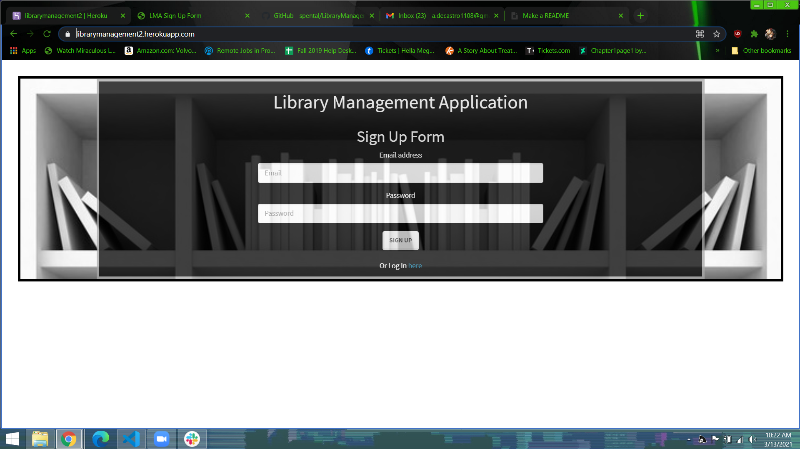
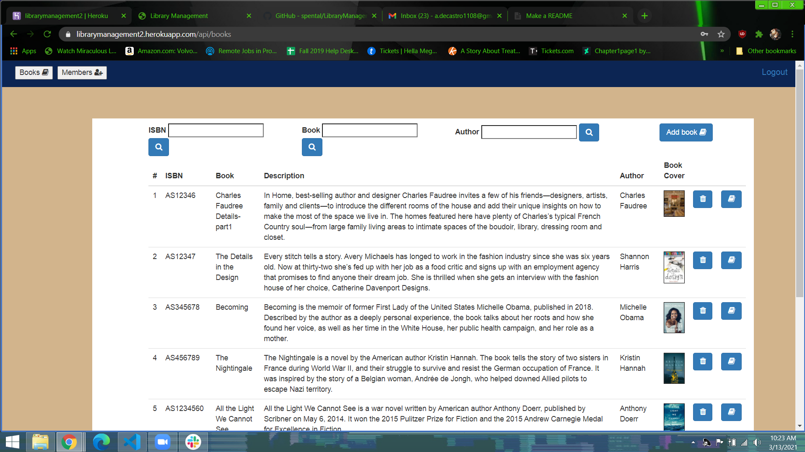
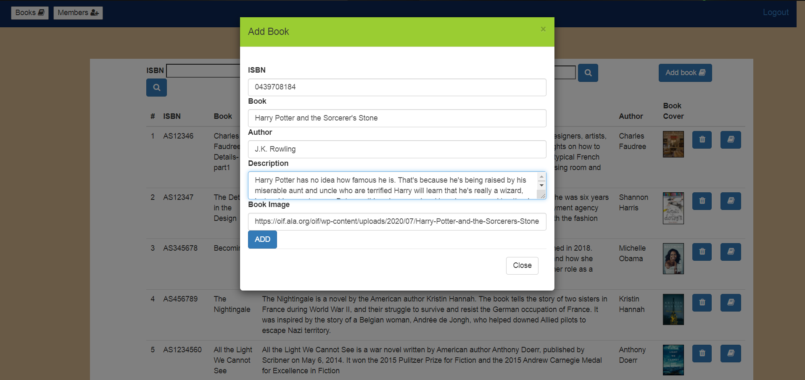
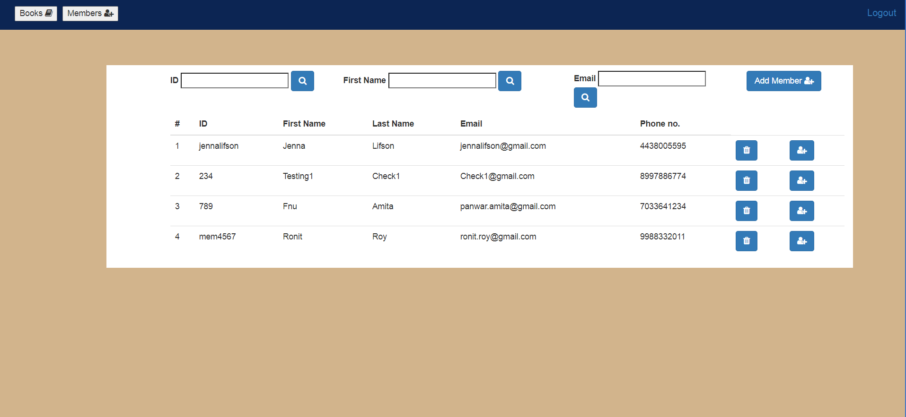
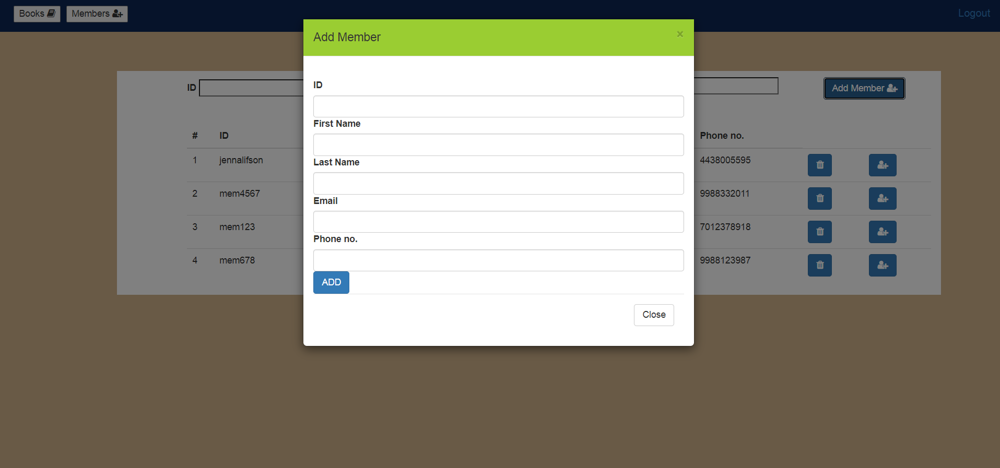
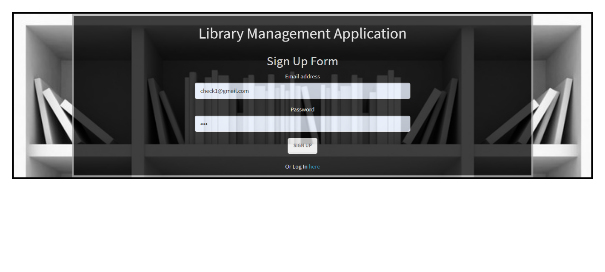
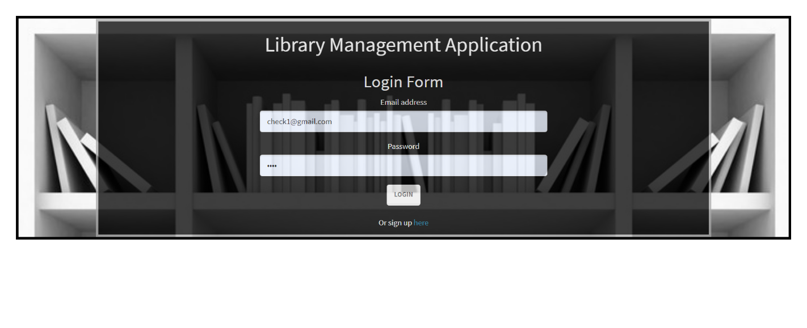
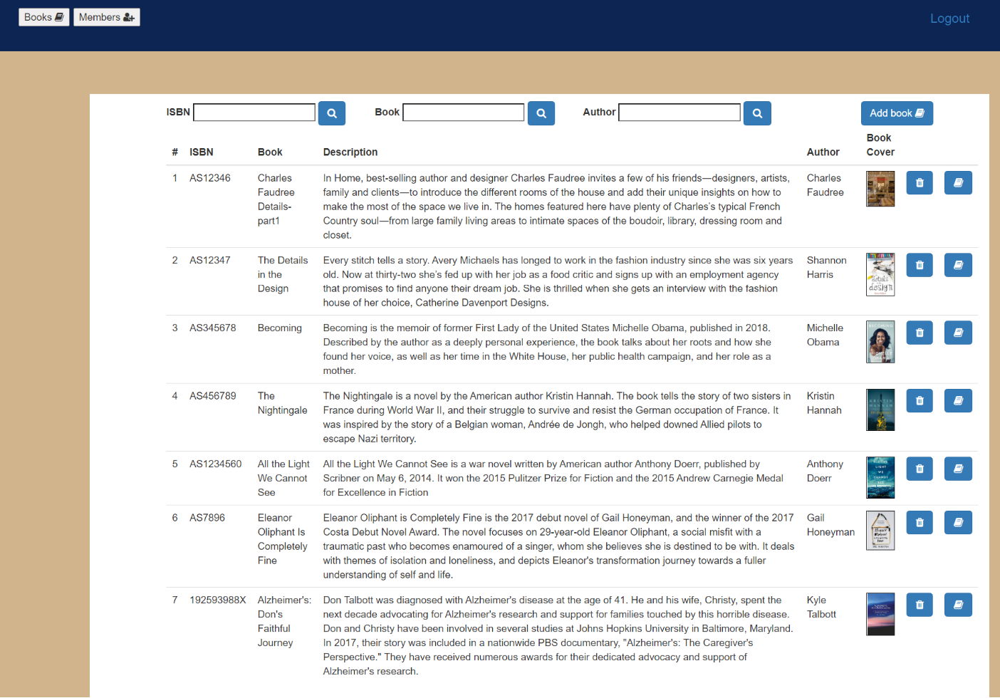
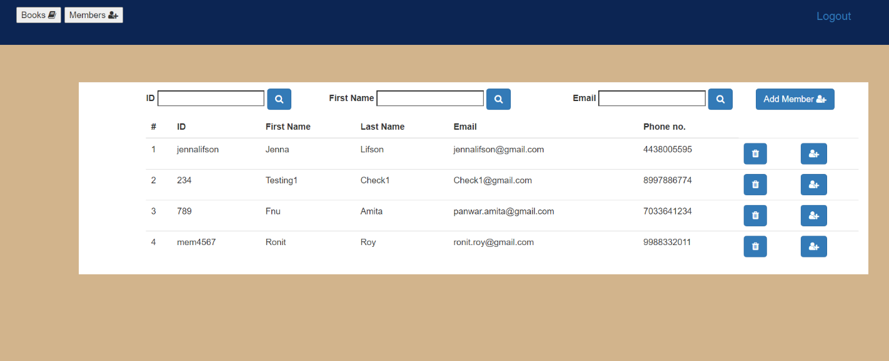

# Library Management

This application is a tool for librarians to view and manage their database of books and library members.

## Table of Contents

* [Introduction](#Introduction)
* [Installation](#Installation)
* [Libraries and Technologies Used](#Libraries)
* [Usage](#Usage)
* [License](#License)
* [Screenshot](#Screenshot)
* [Link](#Link)

## Introduction

 * The Library management application allows librarians to login if they already have an account or sign up if they don't, using passport authentication.
 * After the librarian logs in,the application will display the following:
    * Books :
        Librarian can view all the books from the database.
        Add new book.
        Update an existing book.
        Delete an existing book.
        Search for a book based on ISBN, Author, or Book name.
    * Members :
        Librarian can view all the members of the library.    
        Add new member.
        Update an existing member.
        Delete an existing member.
        Search for a member based on ID, First name, or email.

## Installation

In a web browser, navigate to https://librarymanagement2.herokuapp.com/

## Libraries and Technologies Used

* node js 
* Visual Studio Code 1.51.1
* express
* express handlebars
* MySQL
* Sequelizer
* lodash-contrib

## Usage

Following the link above will take you to the application's sign up page. You can enter your preferred email and password here to make a new account and generate credentials.

After signing up, click on the **Or log in [here](https://librarymanagement2.herokuapp.com/login.html) ** link to navigate to the login page. Enter your email and password into the provided fields and click "LOGIN" to enter.

The Books page will initially display all the library's available books. From here, the user can use the search boxes to search for a book based ISBN, Title, or Author.

Clicking the "Add Book" button will bring up the Add Book modal, which will allow the user to enter information for a new book. Clicking the "ADD" button on the modal will add that book entry to the database and that book will be visible and searchable in the application. 

Clicking the edit button to the right of any book entry will bring up a similar modal which allows the user to update the information of any book entry.

Clicking the delete button to the right of any book entry will immediately delete that book entry from the database.

Clicking the "Members" button in the top right will bring the user to the members page. From here, the user can view all the library members. The user can search for users using the search fields near the top.

Clicking on the "Add Member" button will open the Add Member modal which allows the user to enter information about a new member into the various fields. Clicking the "ADD" button on the modal will create a new member entry in the database, populated with the entered information. 

Clicking on the "Update Member" button to the far right of any member entry will bring up a similar modal which will allow the user to edit and update any information for that member. 

Clicking the "Delete" button next to any member entry will immediately delete that member.

Clicking "Logout" in the top right of either the Books page or the members page will immediately log the user out of the application and bring them to the sign in page.

## License

## Screenshot

## Link

* Link: https://librarymanagement2.herokuapp.com/

